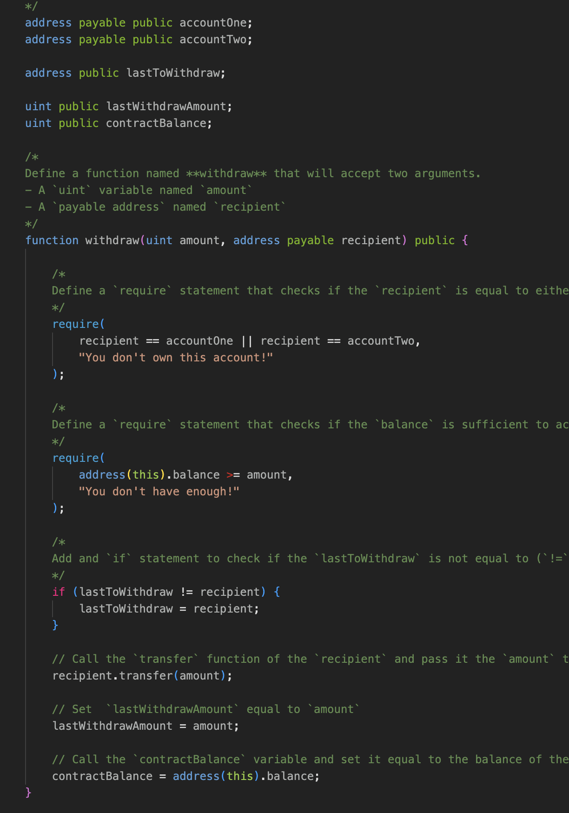

# Solidity - The Language of Blockchain

### Project Outline

* `JointSavings` smart contract.

* `Execution_Results` contains images confirming the transacitons on the blockchain that are being created through the JointSavings smart contract.

### Project 

#### Joint Savings

`Smart Contract`

The basis of the smart contract creates addresses, sets `uint` values so any value can be send througha  transaction and some functions to create smooth transactions. 

1

#### Excecution Results

Located in the the execution results folder are various snippents and screenshots of transactions on the bloackation being deployed through the `JointSavings` smart contract. 
